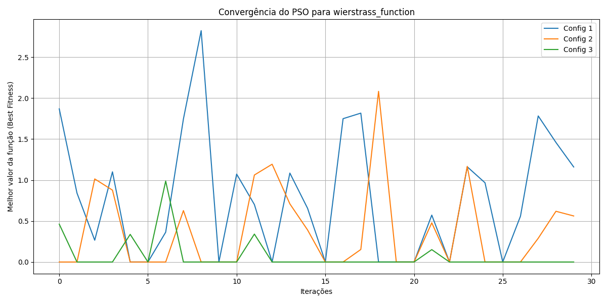
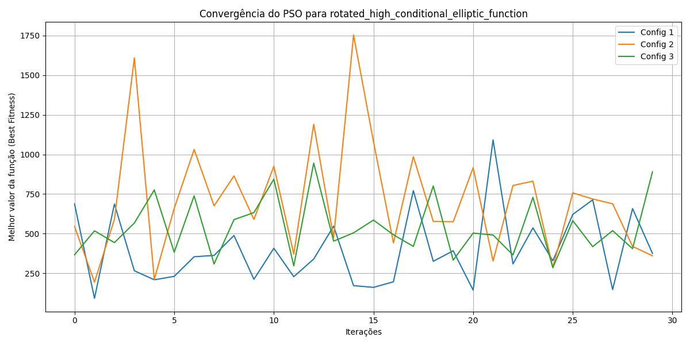

# **Comparação entre configurações do ACOR**

#### **Weierstrass**

* **Configuração 1 (20 formigas, 500 iterações)**:
  * **Best Fitness**: 1.1595407945634228
  * **Median Fitness**: 0.6779633103562634
  * **Mean Fitness**: 0.7915900499855028
  * **Std Fitness**: 0.7530030923579609
  * O ACOR com uma população pequena (20 formigas) e 500 iterações encontrou soluções com fitness relativamente alto (1.1595), indicando que não convergiu para o mínimo global (\(f(x) = 0\)). O desvio padrão elevado (0.753) e a história de fitness com valores variando de \(2.82\) a \(10^{-14}\) sugerem instabilidade e exploração insuficiente do espaço de busca, possivelmente devido ao `sample_count=2`, que limita a diversidade do arquivo de soluções.

* **Configuração 2 (50 formigas, 1000 iterações)**:
  * **Best Fitness**: 0.5618288854096072
  * **Median Fitness**: 9.414691248821327e-14
  * **Mean Fitness**: 0.3740973379725587
  * **Std Fitness**: 0.5141515401138758
  * Com uma população maior (50 formigas) e mais iterações (1000), o ACOR encontrou uma solução significativamente melhor (0.5618) e uma mediana muito próxima do mínimo global (\(\approx 10^{-14}\)). O desvio padrão menor (0.514) indica maior consistência, mas a história de fitness ainda mostra flutuações (ex.: 2.08 a \(10^{-14}\)), sugerindo que o algoritmo alterna entre boas e más soluções, possivelmente devido ao mesmo `sample_count=2`.

* **Configuração 3 (100 formigas, 2000 iterações)**:
  * **Best Fitness**: 7.105427357601002e-14
  * **Median Fitness**: 4.973799150320701e-14
  * **Mean Fitness**: 0.0759380769500916
  * **Std Fitness**: 0.20558631151547924
  * A configuração com maior população (100 formigas) e mais iterações (2000) alcançou o melhor fitness (\(\approx 10^{-14}\)), muito próximo do mínimo global (\(f(x) = 0\)). O desvio padrão baixo (0.2056) e a mediana extremamente pequena (\(\approx 10^{-14}\)) indicam alta estabilidade e convergência consistente, com a maioria dos valores na história próximos de \(10^{-14}\), embora haja algumas iterações com valores mais altos (ex.: 0.987), sugerindo que o algoritmo ainda pode melhorar com ajustes nos parâmetros.

#### **Rotated High Conditional Elliptic**

* **Configuração 1 (20 formigas, 500 iterações)**:
  * **Best Fitness**: 374.6593327911606
  * **Median Fitness**: 346.526482437567
  * **Mean Fitness**: 401.3667978161313
  * **Std Fitness**: 230.5870816116818
  * Com uma população pequena (20 formigas) e 500 iterações, o ACOR encontrou um fitness relativamente alto (374.66), indicando dificuldade em convergir para o mínimo global (\(f(x) = 0\)). O desvio padrão elevado (230.59) e a história de fitness variando de 91.26 a 1091.55 refletem alta variabilidade e exploração insuficiente, provavelmente devido ao `sample_count=2` e ao pequeno número de formigas.

* **Configuração 2 (50 formigas, 1000 iterações)**:
  * **Best Fitness**: 360.1771620001477
  * **Median Fitness**: 667.3298912389994
  * **Mean Fitness**: 714.9395416245035
  * **Std Fitness**: 364.0034659855527
  * Com uma população maior (50 formigas) e 1000 iterações, o ACOR encontrou uma solução ligeiramente melhor (360.18), mas a mediana (667.33) e a média (714.94) indicam que muitas soluções ainda estão distantes do mínimo global. O desvio padrão elevado (364.00) e a história de fitness com valores variando de 193.75 a 1754.32 mostram que o algoritmo não conseguiu estabilizar, sugerindo que o espaço de busca é desafiador para essa configuração.

* **Configuração 3 (100 formigas, 2000 iterações)**:
  * **Best Fitness**: 890.0540981546862
  * **Median Fitness**: 503.9559941069509
  * **Mean Fitness**: 539.2160747326047
  * **Std Fitness**: 180.10776460975023
  * Com a maior população (100 formigas) e 2000 iterações, o ACOR teve um desempenho pior em termos de `best_fitness` (890.05) em comparação com a Configuração 2. No entanto, a mediana (503.96) e o desvio padrão menor (180.11) indicam maior consistência nas soluções. A história de fitness varia de 284.76 a 945.13, sugerindo que o algoritmo explora amplamente, mas não converge para soluções de alta qualidade, possivelmente devido à complexidade da função e ao `sample_count=2`.

### **Conclusão Crítica (ACOR)**

* **Weierstrass**:
  - O ACOR apresentou desempenho crescente com o aumento de `population_size` e `max_iterations`. A **Configuração 3** foi a mais eficaz, alcançando um fitness muito próximo do mínimo global (\(\approx 10^{-14}\)), com alta estabilidade (desvio padrão baixo). No entanto, a **Configuração 1** teve alta variabilidade, e a **Configuração 2** mostrou flutuações, indicando que o parâmetro `sample_count=2` limita a diversidade do arquivo de soluções. Ajustar `sample_count` para um valor maior (ex.: 25 ou 50) e reduzir o `intent_factor` (ex.: 0.2) pode melhorar a convergência, especialmente para as configurações com menos iterações.

* **Rotated High Conditional Elliptic**:
  - O ACOR enfrentou dificuldades significativas para convergir para o mínimo global (\(f(x) = 0\)) em todas as configurações, com fitness na faixa de 360 a 890. A **Configuração 2** teve o melhor fitness (360.18), mas a **Configuração 3** foi mais consistente (menor desvio padrão). A alta variabilidade e os valores elevados de fitness sugerem que o ACOR não é adequado para essa função com os parâmetros atuais, especialmente com `sample_count=2` e o intervalo de busca \([-100, 100]^d\), que é muito amplo para a função elíptica.

### **Visualização**




**Análise do gráfico**:
- **Weierstrass**: Config 3 mostra a melhor convergência, com valores próximos de \(10^{-14}\). Config 1 e 2 têm flutuações maiores, indicando instabilidade devido ao baixo `sample_count`.
- **Rotated High Conditional Elliptic**: Todas as configurações mostram alta variabilidade, com valores de fitness distantes do mínimo global, sugerindo que o ACOR não é ideal para essa função sem ajustes.

**Como rodar o código**:
É recomendado utilizar o `uv` para facilitar gerenciamento de versões.
```bash
uv sync
```
Nesse momento, irá surgir um diretório chamado `.venv`, é preciso fazer um patch no arquivo `optimizer.py` para que o código funcione corretamente. O patch é o seguinte:

```diff
diff --git a/mealpy/optimizer.py b/mealpy/optimizer.py
index 5ef45de..85c55d9 100644
--- a/mealpy/optimizer.py
+++ b/mealpy/optimizer.py
@@ -630,7 +630,7 @@ class Optimizer:
         """
         if type(list_fitness) in [list, tuple, np.ndarray]:
             list_fitness = np.array(list_fitness).flatten()
-        if list_fitness.ptp() == 0:
+        if np.ptp(list_fitness) == 0:
             return int(self.generator.integers(0, len(list_fitness)))
         if np.any(list_fitness < 0):
             list_fitness = list_fitness - np.min(list_fitness)
```
Após isso, é só rodar o seguinte comando:

```bash
uv run aco/run.py -w -r
```
